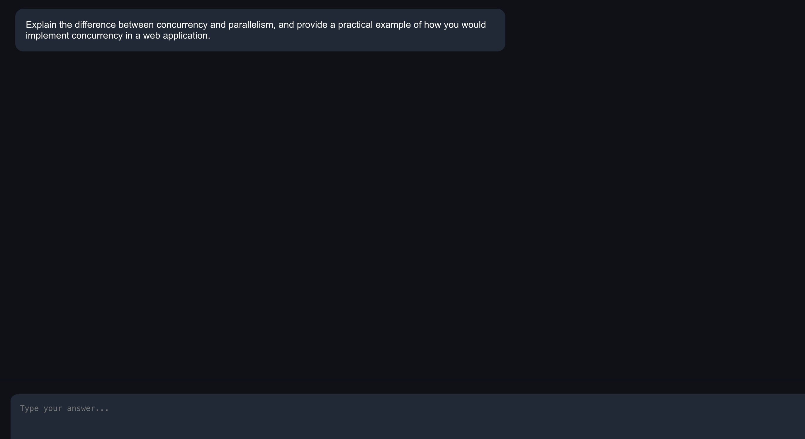
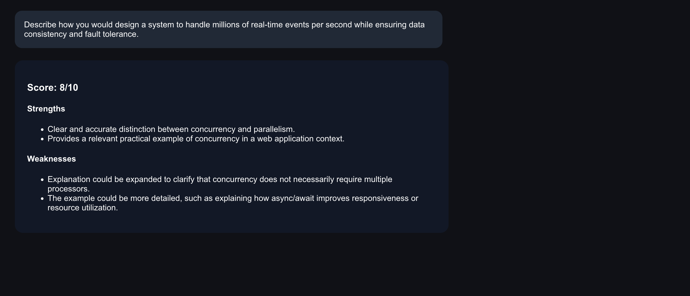

# 🧠 AI Technical Interview Simulator

An AI-powered interview platform that simulates real-world technical interviews across:

- System Design
- Backend Engineering
- Frontend Engineering
- Behavioral Interviews
- Product & Technical Communication

Built to replicate realistic interviewer feedback, scoring, follow-up questions, and architecture evaluation.

---

# 🚀 Features

## 🎯 AI Interviewer

Generates realistic interview questions based on:

- Role
- Difficulty
- Interview type

Example:

- Backend Engineer
- Senior System Design
- Frontend React Interview
- Behavioral Leadership Round

---

## 🧠 Intelligent Answer Evaluation

The AI interviewer evaluates:

- Technical accuracy
- Communication clarity
- Completeness
- Tradeoff thinking
- Scalability understanding

Returns:
- Score
- Strengths
- Weaknesses
- Improvement feedback

---

## 🏗️ System Design Simulator

Generate large-scale architectures for prompts like:

- Design Instagram
- Design Uber
- Design Netflix
- Design WhatsApp

Includes:
- Services
- Databases
- APIs
- Scaling strategy
- Bottleneck analysis
- Mermaid architecture diagrams

---

## ⚠️ Bottleneck Detection

Automatically detects missing:

- Caching layers
- Load balancing
- Replication
- CDN usage
- Scalability protections

---

## 🔁 Multi-Round Interview Sessions

Supports persistent interview sessions with:

- Session memory
- Score tracking
- Interview history
- Sequential follow-up questions

---

## Screenshots

### Home


### Interview Question



### AI Feedback & Results



---

# 🛠️ Tech Stack

## Frontend
- React
- Axios
- Mermaid.js

## Backend
- FastAPI
- OpenAI API
- Pydantic

## AI
- GPT-4.1-mini

---

# 📂 Project Structure

```bash
technical-interview-simulator/
│
├── backend/
│   ├── main.py
│   ├── services/
│   ├── models/
│   └── requirements.txt
│
├── frontend/
│   ├── src/
│   └── package.json
│
└── README.md
```

---

# ⚙️ Installation

## Backend

```bash
cd backend

pip install -r requirements.txt

uvicorn main:app --reload
```

Backend runs on:

```bash
http://127.0.0.1:8000
```

---

## Frontend

```bash
cd frontend

npm install

npm start
```

Frontend runs on:

```bash
http://localhost:3000
```

---

# 🔑 Environment Variables

Create `.env` inside `/backend`:

```env
OPENAI_API_KEY=your_api_key_here
```

---

# 📸 Example Prompts

## System Design

```text
Design Instagram backend
Design YouTube
Design a distributed cache
```

## Interview Practice

```text
Senior backend engineer interview
React frontend interview
Behavioral leadership interview
```

---

# 🧩 Future Improvements

- Voice interviews
- Real-time coding rounds
- Resume-aware interviews
- AI interviewer personalities
- Leaderboards
- Company-specific interview modes
- Live collaborative whiteboarding
